# Vibration Modeling — Ambulance Stretcher Isolation System

**Project title:** Vibration Modeling (*مدل‌سازی ارتعاشی*)
**Authors:** Mohammad Mahdi Yazdanshad (40226438), Amirali Seyednejad (40226428)
**Instructor:** Dr. Afshin Taghvaeipour
**Teaching assistant:** Reza Nopour Holari

> English translation of the original Persian project report. The report develops a five-degree-of-freedom (5-DOF) half-car model of an ambulance carrying a patient on a stretcher, analyzes its free and forced vibration, and designs a secondary isolation system so that the vertical acceleration reaching the patient never exceeds **0.2 g**.

---

## Contents

- [Introduction](#introduction)
- [Part 1 — Modeling and derivation of the equations of motion](#part-1--modeling-and-derivation-of-the-equations-of-motion)
- [Part 2 — Modal analysis and free vibration](#part-2--modal-analysis-and-free-vibration)
- [Part 3 — Frequency response (engine and road excitation)](#part-3--frequency-response-engine-and-road-excitation)
- [Part 4 — Absorber and isolator design](#part-4--absorber-and-isolator-design)
- [Appendix — MATLAB source code](#appendix--matlab-source-code)
- [References](#references)

---

## Introduction

Vehicles — especially in operational environments and on rough roads — are continuously exposed during motion to vibrations and oscillations caused by road irregularities and by internal sources such as the engine. These vibrations are transmitted through the vehicle's suspension system to the body and, ultimately, to the occupants. Under normal conditions these vibrations may merely cause discomfort, but in the case of ambulances, which carry injured and traumatized patients, they can have serious medical consequences.

Patients with spinal injuries, severe fractures, or sensitive post-operative conditions are especially vulnerable to the vertical accelerations imposed on them. Transmitting vibration to such a patient not only jeopardizes recovery but can aggravate existing injuries, cause additional pain, and even lead to dangerous complications. Designing a system that can isolate these vibrations and provide a stable environment for the patient is therefore of vital importance.

In this project we study the dynamics of an ambulance moving over rough ground and design a **secondary suspension system for the stretcher**. The primary system is modeled with five degrees of freedom, capturing the complex interaction between the vehicle chassis and the stretcher. The main challenge is the coupling between chassis motion and stretcher motion, which is influenced by several factors including the position of the stretcher relative to the chassis center of mass.

The ultimate goal of the project is to **optimize the stretcher isolation system so that the acceleration imposed on the patient stays within the safe limit (less than g = 0.2)**, while ensuring that the vehicle's primary suspension also performs adequately.

---

## Part 1 — Modeling and derivation of the equations of motion

Consider the **half-car model** shown in Figure 1, on which a secondary mass–spring system (the stretcher) is mounted. The degrees of freedom are:

- $x_1$ — vertical displacement of the front axle
- $x_2$ — vertical displacement of the rear axle
- $x_c$ — vertical displacement of the chassis center of mass
- $\theta$ — body rotation (pitch) about the center of mass
- $x_s$ — vertical displacement of the stretcher

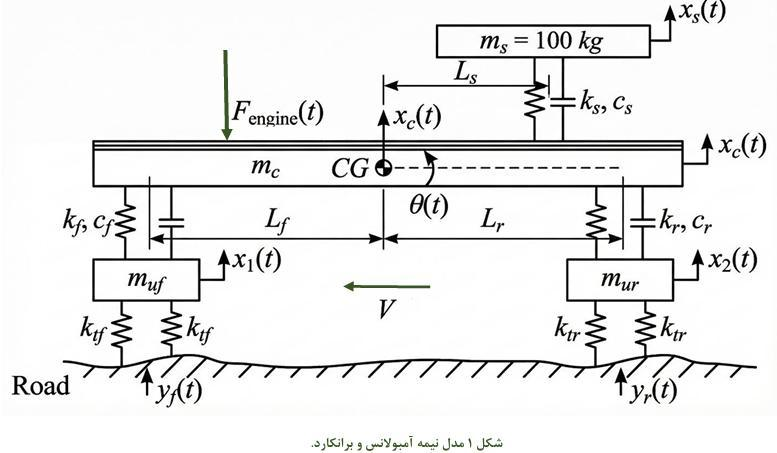

*Figure 1 — Half-car model of the ambulance and stretcher.*

**Required:**

1. Draw the free-body diagram (FBD) for all components.
2. Derive the system's equations of motion using the Lagrange method.
3. Write the equations in matrix form.
4. What is the effect of taking the displacements of the two ends of the chassis as the degrees of freedom, instead of the center-of-mass displacement and rotation?

### 1. Free-body diagrams (FBD) of all components

To derive the equations of motion of the stretcher-equipped ambulance suspension, a free-body diagram (FBD) is first drawn for every component. The model has five degrees of freedom and its components are: the front unsprung mass, the rear unsprung mass, the ambulance body (chassis) with two degrees of freedom (translation and rotation), and the stretcher mass together with the patient. The forces acting on each component are described separately below.

For example, the FBD of the stretcher and patient gives the spring force:

$$F_{\text{spring}} = k_s\,\bigl(x_s - (x_c - L_s\,\theta)\bigr)$$

and, on the ambulance chassis, the reaction of the stretcher spring and damper acting at the stated distance from the center of mass.

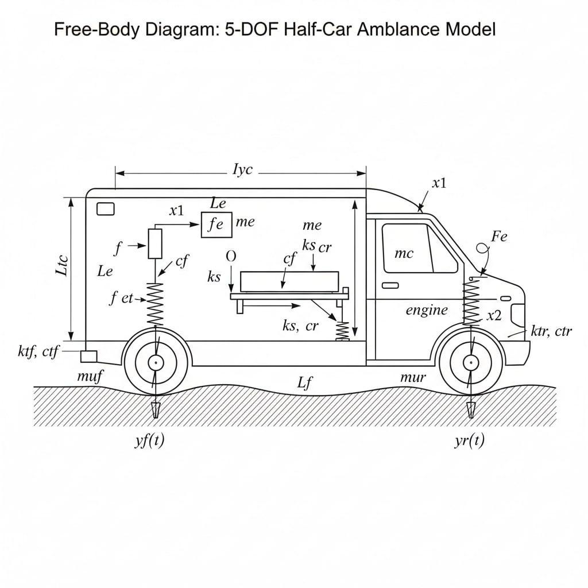

*Figure 2 — Free-body diagram of the 5-DOF half-car ambulance model.*

**Generalized coordinate vector:**

$$q = \begin{bmatrix} x_f & x_r & x_c & \theta & x_s \end{bmatrix}^{T}$$

| Symbol | Meaning |
| --- | --- |
| $x_f$ | vertical displacement of the front unsprung mass (front wheel) |
| $x_r$ | vertical displacement of the rear unsprung mass (rear wheel) |
| $x_c$ | vertical displacement of the chassis center of mass |
| $\theta$ | pitch rotation of the chassis about the center of mass |
| $x_s$ | vertical displacement of the stretcher relative to the chassis |
| $m_{uf}$ | front unsprung mass |
| $m_{ur}$ | rear unsprung mass |
| $m_c$ | chassis mass |
| $I_{yc}$ | chassis moment of inertia about the CG |
| $m_s$ | stretcher mass |
| $k_{tf},\,k_{tr}$ | front and rear **tire** stiffness |
| $k_f,\,k_r$ | front and rear **suspension spring** stiffness |
| $k_s$ | stretcher isolator stiffness |
| $c_f,\,c_r$ | front and rear suspension damping |
| $c_s$ | stretcher isolator damping |
| $L_f,\,L_r$ | distance of the front and rear wheels to the chassis CG |

### Model parameters

| Parameter | Symbol | Value | Unit |
| --- | --- | --- | --- |
| Front unsprung mass (tire + axle) | $m_{uf}$ | 60 | kg |
| Rear unsprung mass | $m_{ur}$ | 80 | kg |
| Front suspension spring stiffness | $k_f$ | 30,000 | N/m |
| Rear suspension spring stiffness | $k_r$ | 35,000 | N/m |
| Front damper coefficient | $c_f$ | 4,000 | N·s/m |
| Rear damper coefficient | $c_r$ | 4,500 | N·s/m |
| Front tire stiffness (sum of the two springs shown) | $k_{tf}$ | 250,000 | N/m |
| Rear tire stiffness (sum of the two springs shown) | $k_{tr}$ | 250,000 | N/m |
| Front axle to CG | $L_f$ | 1.3 | m |
| Rear axle to CG | $L_r$ | 1.7 | m |
| Stretcher + patient mass | $m_s$ | 90 | kg |
| Horizontal distance of stretcher mount to CG | $L_s$ | 0.5 | m |
| Stretcher isolator stiffness | $k_s$ | 12,000 | N/m |
| Stretcher isolator damping | $c_s$ | 1,200 | N·s/m |
| Engine distance from chassis CG | $L_e$ | 1.2 | m |

### Lagrangian energy expressions

**Kinetic energy:**

$$T = \tfrac12 m_{uf}\,\dot{x}_f^2 + \tfrac12 m_{ur}\,\dot{x}_r^2 + \tfrac12 m_c\,\dot{x}_c^2 + \tfrac12 I_{yc}\,\dot{\theta}^2 + \tfrac12 m_s\,(\dot{x}_s + \dot{x}_c)^2$$

**Potential energy:**

$$V = \tfrac12 k_{tf}\,(x_f - y_f)^2 + \tfrac12 k_{tr}\,(x_r - y_r)^2 + \tfrac12 k_f\,(x_f - x_c - L_f\theta)^2 + \tfrac12 k_r\,(x_r - x_c + L_r\theta)^2 + \tfrac12 k_s\,(x_s - x_c)^2$$

**Rayleigh dissipation (damping) function:**

$$D = \tfrac12 c_f\,(\dot{x}_f - \dot{x}_c - L_f\dot{\theta})^2 + \tfrac12 c_r\,(\dot{x}_r - \dot{x}_c + L_r\dot{\theta})^2 + \tfrac12 c_s\,(\dot{x}_s - \dot{x}_c)^2$$

**Lagrange's equations:**

$$\frac{d}{dt}\!\left(\frac{\partial T}{\partial \dot{q}_i}\right) - \frac{\partial T}{\partial q_i} + \frac{\partial D}{\partial \dot{q}_i} + \frac{\partial V}{\partial q_i} = Q_i$$

### Equations of motion

**Front wheel:**

$$m_{uf}\,\ddot{x}_f + c_f\,(\dot{x}_f - \dot{x}_c - L_f\dot{\theta}) + k_f\,(x_f - x_c - L_f\theta) + k_{tf}\,(x_f - y_f) = 0$$

**Rear wheel:**

$$m_{ur}\,\ddot{x}_r + c_r\,(\dot{x}_r - \dot{x}_c + L_r\dot{\theta}) + k_r\,(x_r - x_c + L_r\theta) + k_{tr}\,(x_r - y_r) = 0$$

**Chassis vertical (heave) motion:**

$$\begin{aligned} m_c\,\ddot{x}_c &- c_f\,(\dot{x}_f - \dot{x}_c - L_f\dot{\theta}) - c_r\,(\dot{x}_r - \dot{x}_c + L_r\dot{\theta}) - c_s\,(\dot{x}_s - \dot{x}_c) \\ &- k_f\,(x_f - x_c - L_f\theta) - k_r\,(x_r - x_c + L_r\theta) - k_s\,(x_s - x_c) = F_c(t) \end{aligned}$$

**Chassis rotational (pitch) motion:**

$$\begin{aligned} I_{yc}\,\ddot{\theta} &- c_f L_f\,(\dot{x}_f - \dot{x}_c - L_f\dot{\theta}) + c_r L_r\,(\dot{x}_r - \dot{x}_c + L_r\dot{\theta}) \\ &- k_f L_f\,(x_f - x_c - L_f\theta) + k_r L_r\,(x_r - x_c + L_r\theta) = M_c(t) \end{aligned}$$

This model is used for:

- the time response to road irregularities,
- analysis of vibration transmission to the patient,
- design of the isolator and the tuned mass damper (TMD).

### Matrix form

The equations of motion assemble into the standard second-order matrix form $M\ddot{x} + C\dot{x} + Kx = F(t)$. Substituting the model parameters yields the following numerical matrices.

**Mass matrix $[M]$** (kg, kg·m²):

$$M = \operatorname{diag}\!\bigl(60,\ 80,\ 1800,\ 3000,\ 90\bigr)$$

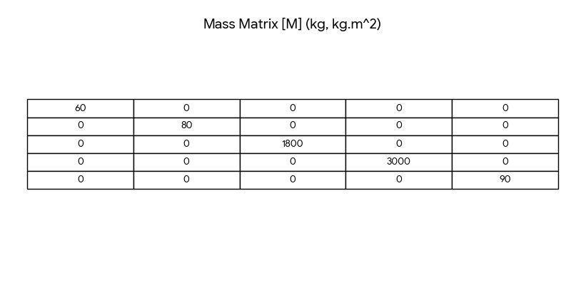

**Stiffness matrix $[K]$** (N/m):

$$K = \begin{bmatrix}
280000 & 0 & -30000 & -39000 & 0 \\
0 & 285000 & -35000 & 59500 & 0 \\
-30000 & -35000 & 77000 & -26500 & -12000 \\
-39000 & 59500 & -26500 & 154850 & 6000 \\
0 & 0 & -12000 & 6000 & 12000
\end{bmatrix}$$

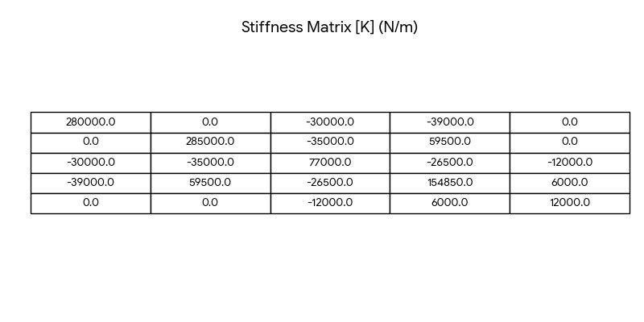

**Damping matrix $[C]$** (N·s/m):

$$C = \begin{bmatrix}
4000 & 0 & -4000 & -5200 & 0 \\
0 & 4500 & -4500 & 7650 & 0 \\
-4000 & -4500 & 9700 & -3050 & -1200 \\
-5200 & 7650 & -3050 & 20065 & 600 \\
0 & 0 & -1200 & 600 & 1200
\end{bmatrix}$$

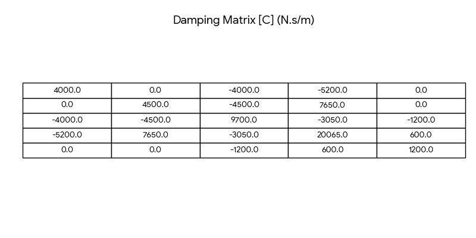

### Effect of choosing the chassis-end displacements as the DOFs

Using the displacements of the two ends of the chassis (the wheels) as degrees of freedom makes the **pitch–heave coupling** of the vibration more explicit. If only $x_c$ and $\theta$ are retained:

- the front and rear impacts enter in a combined form, so the contribution of each individual axle is not directly visible;
- with the end-displacement choice, the road excitation is applied **directly** to a DOF;
- the model becomes more physical and more accurate with respect to the inputs;
- the mass and stiffness matrices take on a different, more "spread-out" structure.

**In summary:** taking the two chassis-end displacements gives a *more accurate, more physical* model, whereas using the center-of-mass displacement plus rotation gives a *more compact but less physical* model.

---

## Part 2 — Modal analysis and free vibration

**Required:**

1. Compute the natural frequencies of the (undamped) system and plot the mode shapes.
2. Investigate how changing the stretcher mounting location $L_s$ changes the natural frequencies. Is there a point at which the chassis vibration has the least effect on the stretcher?
3. Check the proportional-damping condition. If the damping matrix $[C]$ is *not* proportional, explain what solution method should be used instead.

### 1. Natural frequencies and mode shapes

Solving the generalized eigenvalue problem $K\phi = \omega^2 M\phi$ gives the following five natural frequencies and mode shapes.

| Mode | Natural frequency | Dominant motion |
| --- | --- | --- |
| 1 | ≈ 0.80 Hz | chassis heave + stretcher bounce (in phase) |
| 2 | ≈ 1.12 Hz | chassis pitch |
| 3 | ≈ 1.90 Hz | stretcher bounce relative to chassis |
| 4 | ≈ 9.51 Hz | rear wheel hop |
| 5 | ≈ 10.88 Hz | front wheel hop |

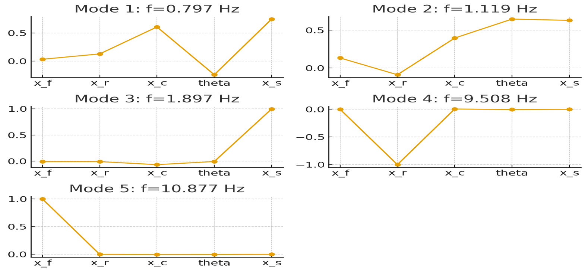

*Mode shapes plotted in modal coordinates $[x_f, x_r, x_c, \theta, x_s]$.*

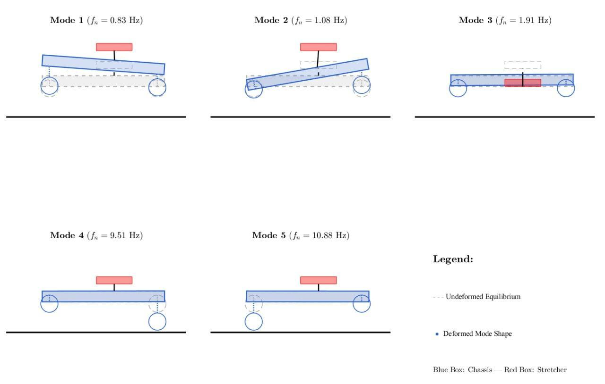

*Physical sketch of the deformed mode shapes — blue: chassis, red: stretcher; dashed: undeformed equilibrium.*

### 2. Effect of the stretcher location $L_s$

For each value of $L_s$ the stiffness (and mass) matrix is modified and the eigenvalue problem is solved again. As the mounting distance increases, the acceleration transmitted to the stretcher in the observed modes changes; the most effective location for minimum transmission is usually **near the center of mass**, or at points that reduce the pitch coupling.

In the half-car model, besides heaving up and down, the ambulance body also rotates (pitch). The stretcher's mounting location relative to the body's center of mass (CG) determines how much of each oscillation mode is transmitted to the patient.

**Physical meaning of changing $L_s$** ($L_s$ = distance from the stretcher mounting base to the ambulance CG):

- If the stretcher sits exactly over the center of gravity ($L_s = 0$), the body's pitch motion has the **least direct effect** on the vertical displacement of the stretcher.
- The closer the stretcher is moved toward the front or rear axle, the larger the share of body pitch in the acceleration imposed on the patient.

**Effect on the natural frequencies:** in the modal analysis, changing the stretcher location changes entries of the stiffness matrix $K$ and mass matrix $M$ (especially in the rows/columns associated with the displacement–rotation coupling). If $L_s$ changes, the natural frequencies (eigenvalues) shift. This means that at a particular speed the road excitation frequency could coincide with one of the system's new natural frequencies and **resonance** could occur.

### 3. Proportional-damping condition

**Proportional (Rayleigh) damping** means the damping matrix can be written as a linear combination of the mass and stiffness matrices:

$$[C] = \alpha[M] + \beta[K]$$

**Advantage of this condition:**

- The damping matrix becomes **diagonal in modal space**.
- Therefore the equations of motion in the different modes are **decoupled** and each mode can be analyzed independently.

With the modal matrix $\phi$ satisfying $M\phi = K\phi\Lambda^{-1}$ (i.e. $K\phi = M\phi\Lambda$):

$$[C]_m = \phi^{T} C \phi = \alpha\,\phi^{T} M \phi + \beta\,\phi^{T} K \phi = \alpha I + \beta\Lambda$$

which is completely diagonal.

**If the damping is not proportional** (i.e. $[C]$ does not diagonalize in the modal basis), the equations remain coupled. In that case the recommended approach is **direct numerical integration of the equations in the time domain** (for example with `ode45` in MATLAB, or an equivalent solver in Python), which does not require the damping matrix to be diagonal.

---

## Part 3 — Frequency response (engine and road excitation)

In this part the simultaneous effects of road and engine are studied. Assume the ambulance engine carries a rotating unbalanced mass. The amount of unbalance in engines is not easily measured directly. In an experiment on a stationary, base-unexcited engine, it was observed that when the engine rotates at **1200 rpm**, the steady-state amplitude of its vertical displacement is **0.4 mm**. (If needed, the engine mass may be taken as 250 kg, the engine stiffness as 650 kN/m, and the damping coefficient as 300 N·s/m.) Treating the chassis as stationary in this case, estimate the engine's rotating unbalance and use it in the rest of the project.

### Overview

The goal here is to study the dynamic behavior of the ambulance and stretcher under realistic excitations and to determine the displacement, acceleration, and force transmitted to the patient. The excitations fall into two categories:

1. **Road excitation**
2. **Engine excitation (rotating imbalance)**

Because the system is linear and has five degrees of freedom (5-DOF), the time-domain numerical solution is used. The main objective of this part is to analyze how much vibration reaches the patient and to assess its safety in terms of the acceleration imposed on the patient's body.

### Estimating the engine unbalance

To model the engine force accurately, experimental data are used. In the experiment:

- the engine speed was 1200 rpm,
- the steady-state vertical displacement amplitude of the engine was measured as 0.4 mm.

Assuming the chassis was rigid and motionless during this test, the engine is modeled as a **single-degree-of-freedom system under a harmonic force**. Using the steady-state response relation

$$X = \frac{F_0}{\sqrt{(K - M\omega^2)^2 + (C\omega)^2}}, \qquad F_0 = (m_u e)\,\omega^2,$$

the rotating unbalance $m_u e$ is obtained and used as the engine-force input in the full ambulance model.

### Applying the engine force in the ambulance model

The engine force is defined as a sinusoidal force at the frequency corresponding to the engine speed and is applied at the actual engine mounting location, accounting for its distance from the chassis CG. This force excites the chassis heave and pitch and, ultimately, the stretcher vibration.

$$F_e(t) = m_e\,e\,\Omega^2\,\sin(\Omega t), \qquad \Omega = \frac{2\pi\,\text{RPM}}{60}$$

Because the engine is located a distance $L_e$ from the chassis CG, it also produces a pitching moment:

$$M_e(t) = F_e(t)\cdot L_e$$

where $m_e$ is the engine effective mass, $e$ the eccentricity, and $\Omega$ the engine angular speed.

### Road excitation modeling

For the road excitation, an irregularity profile is first defined for the front wheel, and the rear-wheel excitation is computed by including a **time delay**. This delay is a function of the wheelbase and the ambulance speed.

The road excitation is applied as a base excitation through the tires. The road displacement is treated as an imposed input to the front and rear wheels:

$$y_f(t) = y(Vt), \qquad y_r(t) = y\bigl(V(t-\tau)\bigr), \qquad \tau = \frac{L_f + L_r}{V}$$

**(a) Bump profile** — modeled as a half-cosine function:

$$y(x) = \begin{cases} \dfrac{h}{2}\Bigl[\,1 - \cos\!\bigl(\tfrac{2\pi x}{L}\bigr)\Bigr], & 0 \le x \le L \\[4pt] 0, & \text{otherwise} \end{cases}$$

with bump height $h = 0.1$ m and bump length $L = 0.3$ m, where $x = Vt$.

**(b) Cushion profile** — a trapezoidal function with a linear rise, a flat region, and a linear fall:

$$y(x) = \begin{cases} \dfrac{h}{a}\,x, & 0 \le x < a \\[4pt] h, & a \le x < a+b \\[4pt] h\Bigl(1 - \dfrac{x-(a+b)}{c}\Bigr), & a+b \le x < a+b+c \\[4pt] 0, & \text{otherwise} \end{cases}$$

with $h = 0.26$ m, $a = 0.26$ m, $b = 1.787$ m, $c = 2.382$ m. This excitation lasts longer and usually has more severe effects on patient comfort.

For both profiles the system response is examined at speeds of **20, 40, 60, and 80 km/h**.

### Numerical simulation

The equations of motion are converted to first-order form and solved with the `ode45` solver in MATLAB, which captures both the transient and steady-state response. The simulation is arranged so that the system first reaches steady state, the road excitation is then applied, and the response is recorded for at least 12 seconds after the wheels pass over the profile.

### Results and outputs

For each case the following are extracted:

- vertical displacement of the chassis and stretcher,
- vertical acceleration of the stretcher,
- force transmitted from the isolator to the patient.

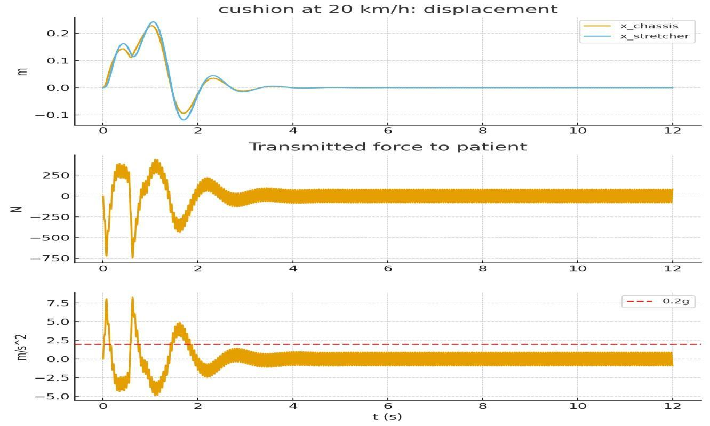

*Time response at 20 km/h (cushion): top — chassis and stretcher displacement; middle — force transmitted to the patient; bottom — stretcher acceleration against the 0.2 g limit.*

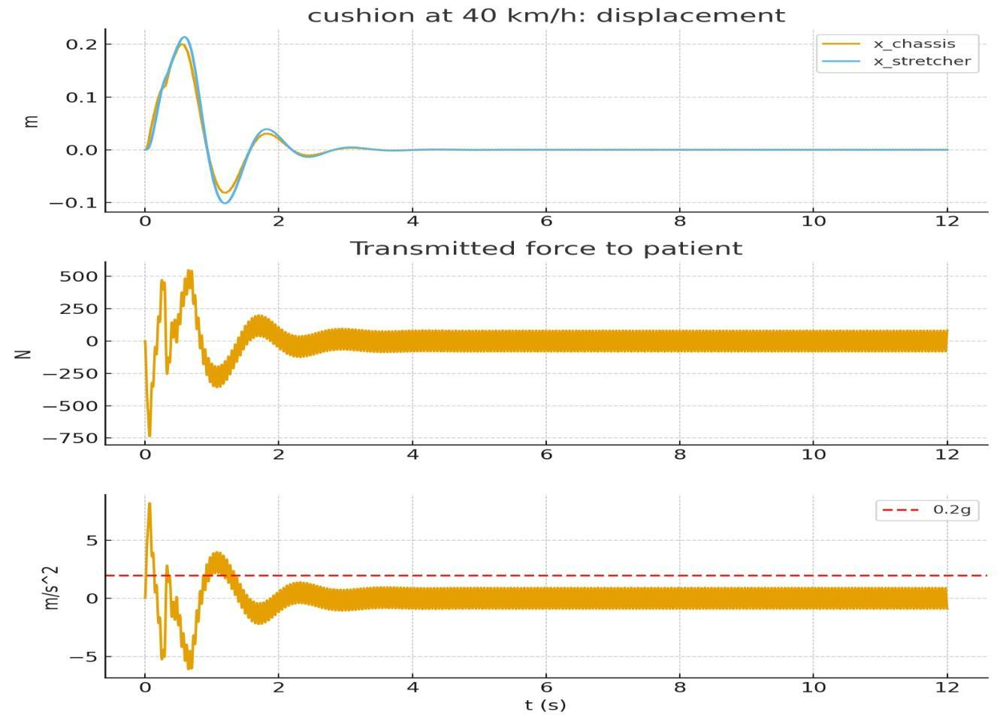

*Time response at 40 km/h (cushion profile).*

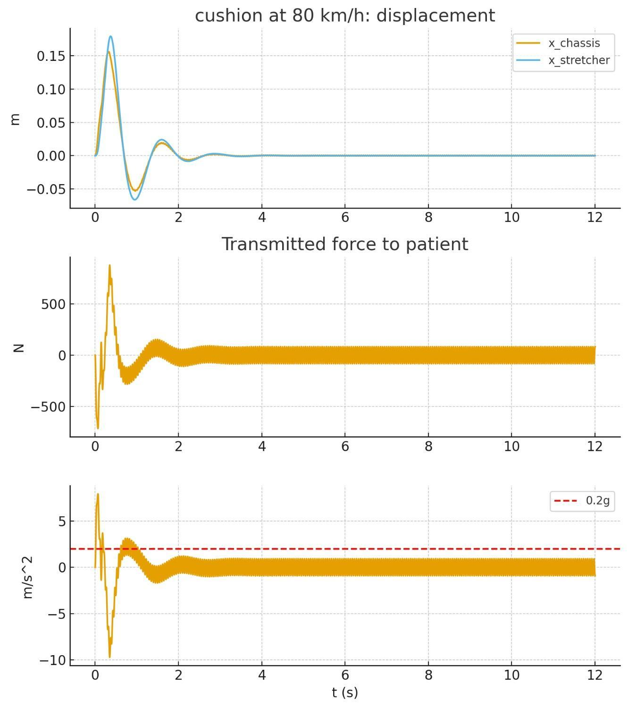

*Time response at 80 km/h (cushion profile).*

### Patient-comfort criterion

The main criterion for evaluating patient comfort is the vertical acceleration imposed on the stretcher:

$$a_s(t) = \ddot{x}_s(t), \qquad |\max(a_s)| \le 0.2\,g$$

If this condition is not satisfied, the stretcher isolation system must be redesigned.

### Patient-safety analysis and summary

Finally, the vertical acceleration imposed on the patient is compared with the allowable limit of 0.2 g. The results of this part show that:

- road excitation — especially at high speeds — plays a more dominant role than the engine;
- a proper choice of isolator parameters can substantially reduce the acceleration transmitted to the patient;
- the **cushion** profile produces the most critical excitation and forms the basis for the isolation-system design;
- engine excitation mainly produces steady-state vibration, whereas the road excitation drives the severe transient response;
- frequency-response analysis is a very effective tool for assessing the safety of moving medical systems such as ambulances.

---

## Part 4 — Absorber and isolator design

The patient has a spinal injury and the vertical acceleration imposed on them must under no circumstances exceed **0.2 g**. The vehicle's primary suspension (the wheels) cannot be changed; you are only permitted to design the suspension under the stretcher ($k_s, c_s$).

**Required:**

1. Determine the optimum stiffness $k_s$ and damping $c_s$ for the stretcher isolation system.
2. Could a vibration absorber attached to the stretcher be more effective than the under-stretcher suspension? (Prove with simulation.)
3. If only the stretcher and its isolation system pass over the profiles (a single-degree-of-freedom system moving over a sinusoidal path), how does the system respond and how do changes in stiffness, damping, and the absorber affect it?

### Design goal

Given that the patient has a spinal injury, one of the most important design requirements for the stretcher is to limit the vertical acceleration imposed on the patient. According to the problem statement this acceleration must under no circumstances exceed 0.2 g. The vehicle's primary suspension — tires, springs, and front/rear shock absorbers — is fixed, and the only design freedom is the choice of the under-stretcher suspension. The main goal of this part is therefore to design a suitable isolation system for the stretcher in order to reduce the transmission of vibration from the chassis to the patient.

### Modeling the stretcher subsystem

To study the dynamic behavior of the stretcher, this part of the system is treated as a mass connected to the chassis. The stretcher is attached to the chassis through a spring and a damper, whose main role is to absorb vibration and reduce the acceleration transmitted to the patient. The stretcher motion is directly affected by the chassis motion at the mounting point. Because of the chassis pitch rotation, the motion of the stretcher attachment point is a combination of the chassis CG vertical displacement and a component due to body rotation.

### Excitations acting on the system

The vibrations reaching the stretcher come from two main sources: **road excitation** and **engine excitation**.

The road excitation is modeled as the vehicle passing over a standard speed bump with a smooth, continuous shape so that real road behavior is reproduced. The front wheel hits the obstacle first, and after a time delay — which depends on the wheelbase and speed — the rear wheel passes over it as well. This time delay produces a pitch response in the chassis and plays an important role in the stretcher dynamics.

The engine excitation arises from the unbalance of the engine's rotating mass. This unbalance produces a periodic vertical force that varies with engine speed. It is applied to the chassis and can cause stretcher vibration even when there is no road excitation.

### Performance criterion

To evaluate the isolation system, the vertical acceleration of the stretcher is taken as the main criterion, because this acceleration is transmitted directly to the patient's body. So that the design is valid under all operating conditions, the system behavior is examined at several vehicle speeds, and the **worst stretcher acceleration across all speeds and over the whole motion period** is used as the decision criterion. In addition to acceleration, the relative displacement between the stretcher and the chassis is indirectly controlled to prevent excessive travel and practical problems.

### Results before optimization

In the initial case, using the project's suggested values for the stretcher spring and damper ($k_s = 12{,}000$ N/m, $c_s = 1{,}200$ N·s/m), the simulation showed that the stretcher acceleration is significantly affected by vehicle speed. As speed increases, the acceleration peaks grow and in some conditions approach the allowable limit. This shows that the chosen initial values, although acceptable, are not optimal.

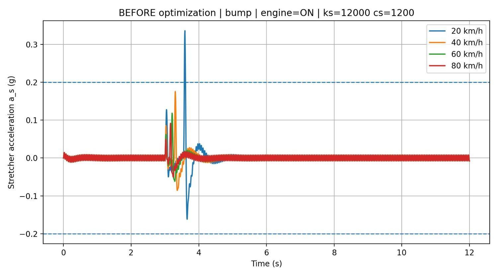

*Before optimization (bump, engine on, $k_s = 12{,}000$, $c_s = 1{,}200$): the peak at 20 km/h exceeds the 0.2 g limit.*

### Optimizing the isolation system

To improve performance, an optimization was performed on the stretcher spring and damper parameters. The aim was to find a combination of the two that produces the smallest possible vertical stretcher acceleration at all examined speeds. The optimization focused on reducing the worst-case response, since in medical applications safety under critical conditions is most important. A grid search over $k_s$ and $c_s$ minimizes the worst-case peak acceleration while keeping the relative travel within limits.

### Results after optimization

After optimization, new values of the stretcher spring and damper ($k_s \approx 6{,}000$ N/m, $c_s \approx 400$ N·s/m) were obtained that significantly reduce the acceleration transmitted to the patient. The simulation showed that at all examined speeds the vertical stretcher acceleration is noticeably reduced and always stays below the prescribed limit, demonstrating the successful performance of the designed isolation system.

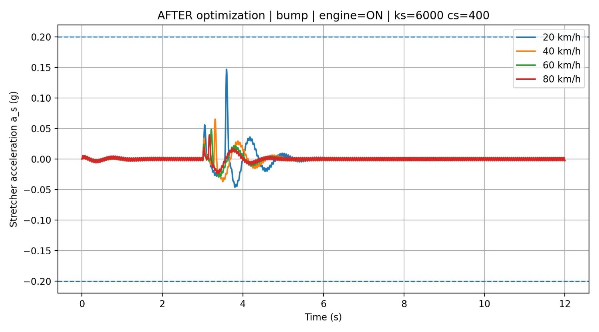

*After optimization (bump, engine on, $k_s = 6{,}000$, $c_s = 400$): the stretcher acceleration stays well below the 0.2 g limit at every speed.*

### Physical interpretation of the results

Reducing the spring stiffness lets the stretcher decouple more softly from the chassis, so vibrations are transmitted to the patient with lower intensity. Choosing a suitable damping value controls the oscillations and prevents excessive stretcher motion. A proper combination of these two factors creates a balance between reducing acceleration and maintaining system stability.

### Summary

In this part the under-stretcher isolation system was designed and optimized. The results showed that with a proper choice of spring and damper parameters the acceleration imposed on the patient can be effectively reduced and the prescribed safety condition met under all operating conditions of the vehicle. The design can therefore serve as an effective solution for improving patient safety in ambulances.

---

## Appendix — MATLAB source code

The full MATLAB source used in the project is collected in the [`code/`](code/) folder. A short description of each file follows.

| File | Purpose |
| --- | --- |
| [`run_project.m`](code/run_project.m) | Main driver: builds the matrices, runs modal analysis, simulates all profiles/speeds, proposes an isolator and a TMD. |
| [`build_MKC_5DOF.m`](code/build_MKC_5DOF.m) | Assembles the 5-DOF mass, stiffness, and damping matrices. |
| [`modal_analysis.m`](code/modal_analysis.m) | Solves the generalized eigenvalue problem; returns mode shapes and natural frequencies. |
| [`plot_modes.m`](code/plot_modes.m) | Plots the five mode shapes. |
| [`simulate_time_response.m`](code/simulate_time_response.m) | Integrates the equations of motion with `ode45`. |
| [`road_profile.m`](code/road_profile.m) | Bump and cushion road-profile functions. |
| [`plot_time_responses.m`](code/plot_time_responses.m) | Plots displacement, transmitted force, and stretcher acceleration. |
| [`design_isolator.m`](code/design_isolator.m) | Simple single-DOF isolator design. |
| [`design_TMD.m`](code/design_TMD.m) | Tuned-mass-damper design. |
| [`part4_optimization.m`](code/part4_optimization.m) | Part 4: estimates the engine unbalance and runs the grid-search optimization of $k_s, c_s$. |

> Note: the code is transcribed from the appendix of the original report. A few obvious extraction artifacts (missing semicolons / a truncated line) were lightly corrected so the files run; the logic is unchanged.

---

## References

The original report lists the following vibration-analysis resources:

1. *Predictive Maintenance and Vibration Resources* — a GitHub repository offering datasets and papers related to predictive maintenance and vibration analysis.
2. *Vibration Measurement Project* — a National Instruments project providing methodologies and resources for designing and implementing vibration-measurement systems.
3. *Free Vibration Analysis Files* — enDAQ example analysis scripts and vibration data for various applications, including aircraft and transportation monitoring.
4. *Real Vibrations* — a participatory research project building a digital database of experimentally acquired vibration signals from everyday objects and human movement.
5. *How To Build A Cheap Vibration Generator* — a DIY guide for a simple, versatile vibration generator for physics experiments.
6. *Vibration Mechanics* — an open-source textbook for undergraduates covering vibration principles, measurement, and instrumentation.

---

*This document is an English translation of the original Persian project report “مدل‌سازی ارتعاشی”. Figures are reproduced from the original.*
